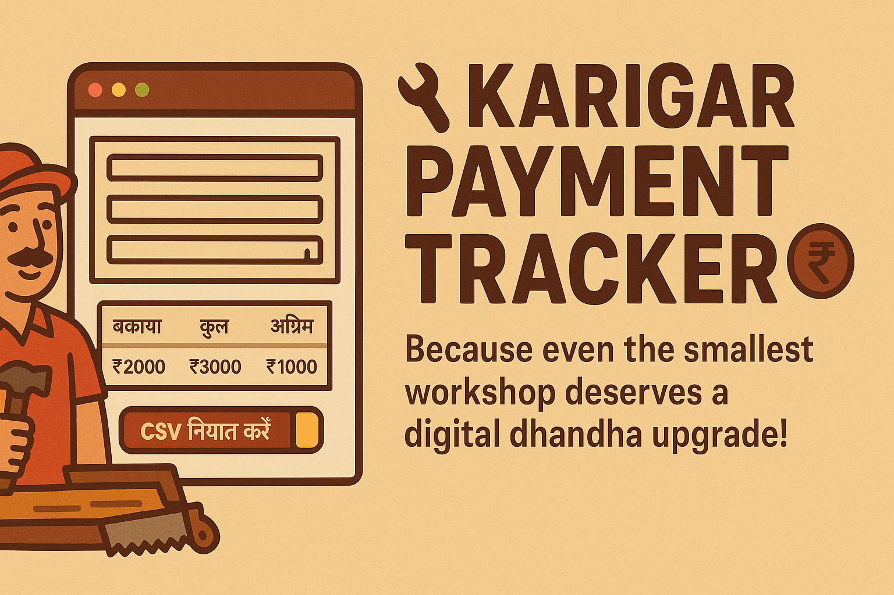
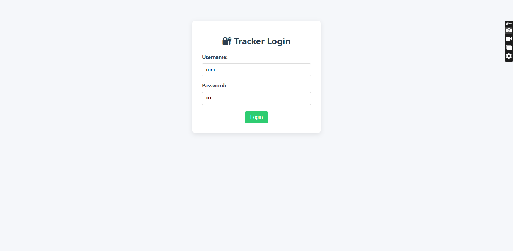
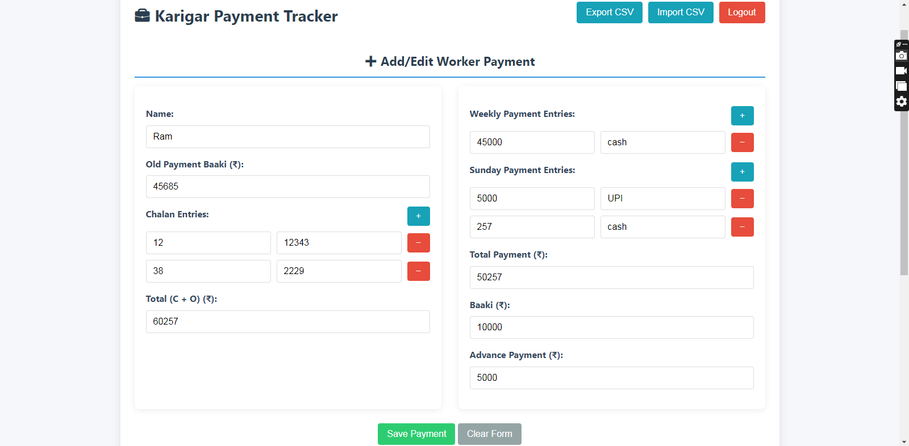
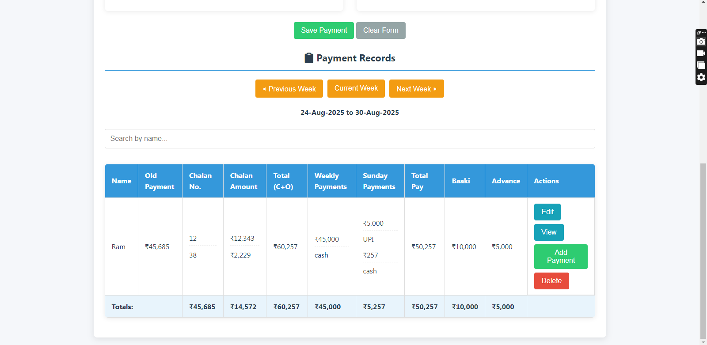

# 💼 Karigar Payment Tracker 

> Because even the smallest workshop deserves a *digital dhandha* upgrade! 💸✨

Namaste, fellow chai-sipper and business boss! ☕🔥  
Meet **Karigar Payment Tracker** — the no-Internet, no-Excel, no-stress tool built for real Indian small businesses.  

Running on a 2GB RAM machine from 2009? Using Notepad and scared of "the cloud"? 😅  
**No problem.** This app works like magic — right on your old Windows 7 PC. Just double-click and go! ✅

---

## 🎯 What It Does

Track payments for your karigars (workers) like a pro — without internet, without Excel, without tears.

- ✅ Add worker names with smart autocomplete  
- ✅ Record chalan numbers, weekly & Sunday payments  
- ✅ Auto-calculate **baaki**, **total**, and **advance**  
- ✅ Search, edit, delete — and **export to CSV**  
- ✅ Import data back anytime (perfect for backup!)  
- ✅ View details & download as **JPEG image** 🖼️  
- ✅ Navigate between weeks: Previous, Current, Next  

All in a single `.html` file. No installation. No drama. Just double-click and work! 💻➡️💰

---

##  Built for the Real India

| Feature | Why It Rocks |
|--------|-------------|
| **Zero Dependencies** | No Node, no Python, no admin rights needed |
| **Works Offline** | Internet? *Aane wala hai.* This app? Works **now**. |
| **Light as a Paratha** | Under 100KB — runs smooth on your 2009 PC |
| **Data Stays with You** | Saved in your browser — no server, no leaks 🔐 |
| **Edit in Notepad** | Yes, even the code! Customize like a boss |

---

## 🚀 How to Use?

1. **Download** `index.html`  
2. **Double-click** to open in any browser (Chrome, Firefox, even IE!)  
3. **Login** with:  
   - Username: `ram`  
   - Password: `ram`  
4. **Start adding** workers & payments  
5. **Export to CSV** anytime for safe backup  

> 💡 Pro Tip: Keep a backup of the file — your data lives inside it!

---

##  Customize It in Notepad

Want to change the name? Add your shop logo? Translate to Hindi?  
Just open `index.html` in **Notepad** and tweak the text!  

It's all in one file — no build tools, no npm, no fear.  
Make it *gaon ka superstar* 🌟 or *mohalla ka must-have*.

---

## 📦 Why This on GitHub?

Because small businesses power India.  
And you shouldn’t need a MacBook or Wi-Fi to run your dukaan like a pro.  

This tool is for the tailor, the carpenter, the mechanic, the home workshop hero.  
You keep India moving. This app? Just helps you pay on time. 💪

---

##  Screenshot (Imagine This!)

---

##  Important: Backup Your Data!

This app uses your browser’s `localStorage`.  
If you clear browser data → **your records vanish**. 😱  

So please:  
 **Export CSV weekly**  
 **Save a copy on USB or D drive**  
 Like your nani’s pickle recipe — don’t lose it!

---

## Want to Improve It?

PRs welcome! Whether it’s:
- Hindi translation
- Better design
- Print feature
- Or just fixing a typo  

Let’s make this better — for every small business fighting the chaos of cash, chits, and calculations. 🙏

---

⭐ **Star it** | 📢 **Share it** | 💬 **Feedback? Just edit the HTML!**

---

> Made with ❤️, cutting chai, and deep respect for *offline-first* businesses.  
> Jai Hind, Jai Dhandha! 🇮🇳
